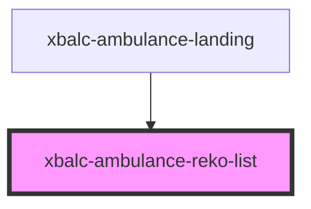

# xbalc-ambulance-reko-list

<!-- Auto Generated Below -->

## Properties

| Property   | Attribute   | Description | Type                                  | Default     |
| ---------- | ----------- | ----------- | ------------------------------------- | ----------- |
| `apiBase`  | `api-base`  |             | `string`                              | `undefined` |
| `userType` | `user-type` |             | `UserType.DOCTOR \| UserType.PATIENT` | `undefined` |
| `username` | `username`  |             | `string`                              | `undefined` |

## Events

| Event          | Description | Type                  |
| -------------- | ----------- | --------------------- |
| `entryClicked` |             | `CustomEvent<string>` |

## Dependencies

### Used by

 - [xbalc-ambulance-landing](../xbalc-ambulance-landing)

### Graph

----------------------------------------------

*Built with [StencilJS](https://stenciljs.com/)*
